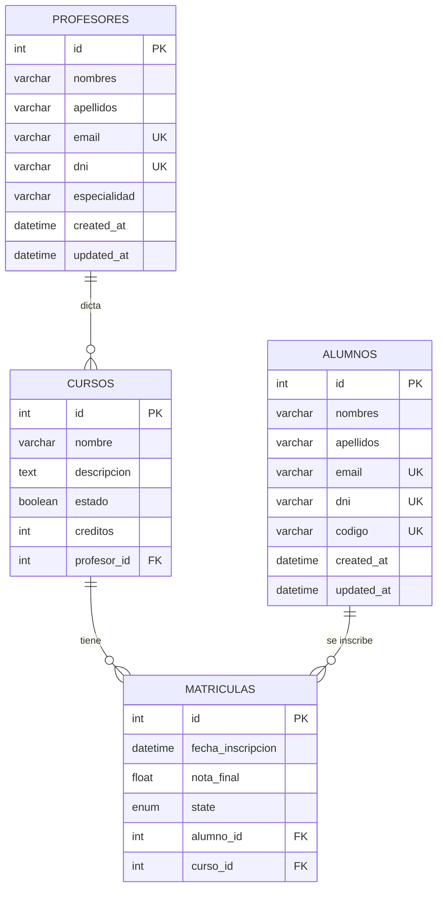
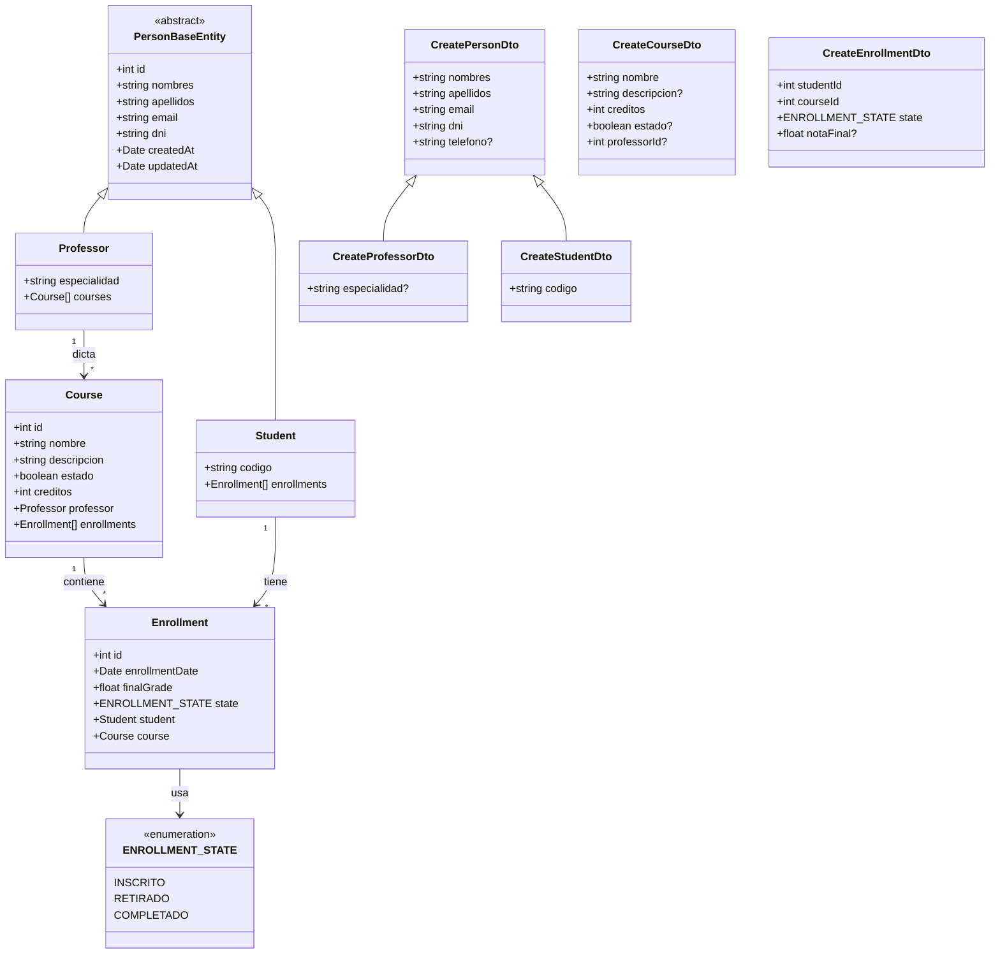
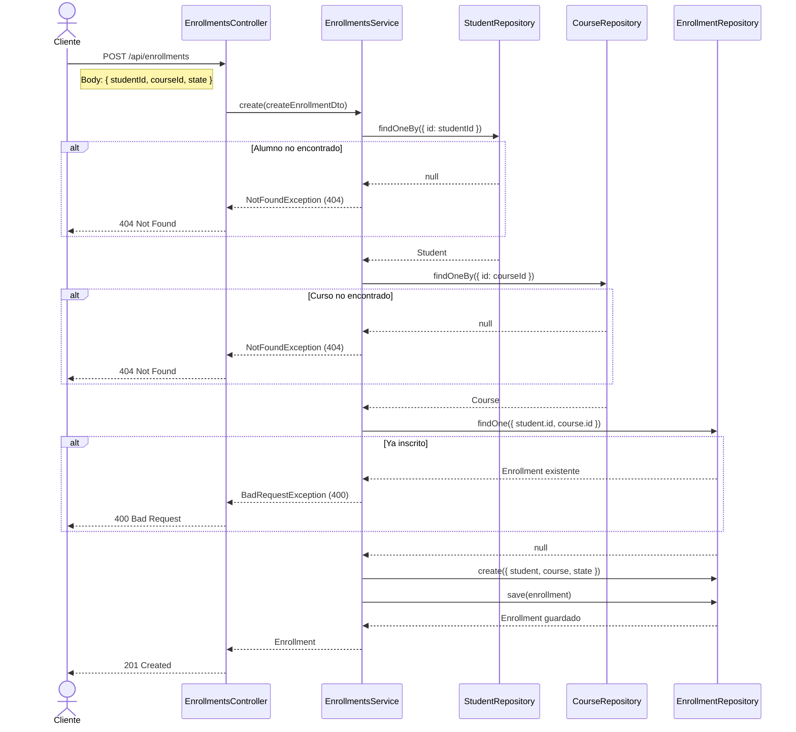

# Gestor Académico API

> API REST desarrollada con **NestJS** para la gestión académica de cursos, profesores y alumnos. Permite registrar, relacionar y consultar información de forma eficiente.


---

## Tabla de Contenidos

- [Características](#características)
- [Stack Tecnológico](#stack-tecnológico)
- [Requisitos Previos](#requisitos-previos)
- [Instalación y Ejecución](#instalación-y-ejecución)
- [Variables de Entorno](#variables-de-entorno)
- [Endpoints de la API](#endpoints-de-la-api)
- [Importación Masiva](#importación-masiva)
- [Seed de Datos Iniciales](#seed-de-datos-iniciales)
- [Arquitectura del Proyecto](#arquitectura-del-proyecto)
- [Diagrama Entidad-Relación](#diagrama-entidad-relación)
- [Diagrama de Clases](#diagrama-de-clases)
- [Diagrama de Secuencia](#diagrama-de-secuencia)
- [Decisiones Técnicas](#decisiones-técnicas)
- [Licencia](#licencia)

---

## Características

- CRUD completo para **Cursos**, **Profesores**, **Alumnos** y **Matrículas**
- Asignación de profesores a cursos
- Inscripción de alumnos a cursos (con validación de duplicados)
- **Importación masiva** desde archivos `.xlsx` / `.csv` en todos los módulos
- **Paginación** en todos los listados (`limit` / `offset`)
- **Filtrado** de cursos por estado (activo / inactivo)
- Documentación interactiva con **Swagger** en `/api/docs`
- **Seed** de datos iniciales (profesores, cursos, alumnos y matrículas)
- Validación de datos con **DTOs** y `class-validator`
- Dockerizado con **Docker Compose** (MySQL + API + Adminer)
- Validación de variables de entorno con **Joi**
- Manejo centralizado de errores (400, 404, 500)

---

## Stack Tecnológico

| Tecnología | Versión | Propósito |
|---|---|---|
| **NestJS** | 11.x | Framework backend |
| **TypeORM** | 11.x | ORM para base de datos |
| **MySQL** | 8.0 | Base de datos relacional |
| **Swagger** | 11.x | Documentación de API |
| **class-validator** | 0.14.x | Validación de DTOs |
| **class-transformer** | 0.5.x | Transformación de datos |
| **xlsx** | 0.18.x | Parseo de archivos Excel / CSV |
| **Joi** | 18.x | Validación de variables de entorno |
| **Docker** | - | Contenedorización |

---

## Requisitos Previos

- **Node.js** >= 18.x
- **npm** >= 9.x
- **MySQL** 8.0 (o Docker)
- **Docker** y **Docker Compose** (opcional, recomendado)

---

## Instalación y Ejecución

### Opción 1: Con Docker (Recomendado)

```bash
# 1. Clonar el repositorio
git clone https://github.com/<tu-usuario>/gestor-academico-api.git
cd gestor-academico-api

# 2. Crear archivo .env (copiar del ejemplo)
cp .env.example .env

# 3. Levantar todos los servicios (MySQL + API + Adminer)
docker compose up --build

# La API estará disponible en http://localhost:3000
# Swagger UI en http://localhost:3000/api/docs
# Adminer (gestor visual de BD) en http://localhost:8080
```

### Opción 2: Sin Docker (Manual)

```bash
# 1. Clonar el repositorio
git clone https://github.com/<tu-usuario>/gestor-academico-api.git
cd gestor-academico-api

# 2. Instalar dependencias
npm install

# 3. Configurar variables de entorno
cp .env.example .env
# Editar .env con las credenciales de tu MySQL local

# 4. Asegurarse de tener MySQL corriendo y crear la base de datos
mysql -u root -p -e "CREATE DATABASE gestor_academico_db;"

# 5. Ejecutar en modo desarrollo (con hot-reload)
npm run start:dev
```

### Cargar datos de prueba (Seed)

```bash
# Una vez la API esté corriendo, ejecutar:
curl http://localhost:3000/api/seed
```

---

## Variables de Entorno

Crear un archivo `.env` en la raíz del proyecto basado en `.env.example`:

| Variable | Descripción | Valor por defecto |
|---|---|---|
| `PORT` | Puerto de la API | `3000` |
| `DB_HOST` | Host de MySQL | `localhost` |
| `DB_PORT` | Puerto de MySQL | `3306` |
| `DB_USER` | Usuario de MySQL | — |
| `DB_PASSWORD` | Contraseña de MySQL | — |
| `DB_NAME` | Nombre de la base de datos | — |

---

## Endpoints de la API

> Prefijo global: `/api`  
> Documentación interactiva: `GET /api/docs`

### Cursos — `/api/courses`

| Método | Ruta | Descripción |
|---|---|---|
| `POST` | `/api/courses` | Crear un curso |
| `GET` | `/api/courses` | Listar cursos (paginado) |
| `GET` | `/api/courses?estado=true` | Filtrar cursos activos |
| `GET` | `/api/courses?estado=false` | Filtrar cursos inactivos |
| `GET` | `/api/courses/:id` | Ver detalle de un curso |
| `PATCH` | `/api/courses/:id` | Actualizar un curso |
| `DELETE` | `/api/courses/:id` | Eliminar un curso |
| `PUT` | `/api/courses/:courseId/assign-professor/:professorId` | Asignar profesor a curso |
| `POST` | `/api/courses/upload` | Importación masiva (xlsx/csv) |

### Profesores — `/api/professors`

| Método | Ruta | Descripción |
|---|---|---|
| `POST` | `/api/professors` | Crear un profesor |
| `GET` | `/api/professors` | Listar profesores (paginado) |
| `GET` | `/api/professors/:id` | Ver detalle de un profesor |
| `PATCH` | `/api/professors/:id` | Actualizar un profesor |
| `DELETE` | `/api/professors/:id` | Eliminar un profesor |
| `POST` | `/api/professors/upload` | Importación masiva (xlsx/csv) |

### Alumnos — `/api/students`

| Método | Ruta | Descripción |
|---|---|---|
| `POST` | `/api/students` | Crear un alumno |
| `GET` | `/api/students` | Listar alumnos (paginado) |
| `GET` | `/api/students/:id` | Ver detalle de un alumno |
| `PATCH` | `/api/students/:id` | Actualizar un alumno |
| `DELETE` | `/api/students/:id` | Eliminar un alumno |
| `POST` | `/api/students/upload` | Importación masiva (xlsx/csv) |

### Matrículas — `/api/enrollments`

| Método | Ruta | Descripción |
|---|---|---|
| `POST` | `/api/enrollments` | Inscribir alumno en curso |
| `GET` | `/api/enrollments` | Listar matrículas (paginado) |
| `GET` | `/api/enrollments/:id` | Ver detalle de matrícula |
| `PATCH` | `/api/enrollments/:id` | Actualizar matrícula |
| `DELETE` | `/api/enrollments/:id` | Eliminar matrícula |
| `POST` | `/api/enrollments/upload` | Importación masiva (xlsx/csv) |

### Seed — `/api/seed`

| Método | Ruta | Descripción |
|---|---|---|
| `GET` | `/api/seed` | Ejecutar semilla de datos iniciales |

### Parámetros de paginación

Todos los endpoints de listado (`GET`) soportan:

| Parámetro | Tipo | Descripción | Ejemplo |
|---|---|---|---|
| `limit` | number | Cantidad de resultados por página | `?limit=20` |
| `offset` | number | Cantidad de resultados a omitir | `?offset=10` |

---

## Importación Masiva

Todos los módulos soportan importación masiva desde archivos `.xlsx` y `.csv` a través del endpoint `POST /upload`.

**Ejemplo con curl:**

```bash
curl -X POST http://localhost:3000/api/students/upload \
  -F "file=@alumnos.xlsx"
```

**Formato del archivo Excel para alumnos:**

| nombres | apellidos | email | dni | codigo |
|---|---|---|---|---|
| Juan | Pérez | juan@email.com | 12345678 | ST-001 |
| María | López | maria@email.com | 87654321 | ST-002 |

**Respuesta:**

```json
{
  "message": "Bulk import process completed",
  "report": {
    "total": 2,
    "success": 2,
    "errors": []
  }
}
```

---

## Seed de Datos Iniciales

El endpoint `GET /api/seed` carga datos de prueba:

- **5 Profesores** — Alan Turing, Grace Hopper, Richard Feynman, Marie Curie, Nikola Tesla
- **6 Cursos** — 4 activos + 2 inactivos (para pruebas de filtrado)
- **5 Alumnos** — con códigos ST-001 a ST-005
- **3 Matrículas** — con estados: inscrito, completado y retirado

> **Nota:** El seed está protegido y no se ejecuta cuando `NODE_ENV=prod`.

---

## Arquitectura del Proyecto

```
src/
├── main.ts                            # Bootstrap de la aplicación
├── app.module.ts                      # Módulo raíz
│
├── config/
│   └── env.validation.ts              # Validación de variables de entorno (Joi)
│
├── common/                            # Recursos compartidos
│   ├── dto/
│   │   ├── create-person.dto.ts       # DTO base para personas
│   │   └── pagination.dto.ts          # DTO de paginación reutilizable
│   ├── entities/
│   │   └── person.base.entity.ts      # Entidad abstracta (id, nombres, apellidos, email, dni)
│   ├── enums/
│   │   └── enrollment_state.ts        # Enum: inscrito | retirado | completado
│   ├── services/
│   │   └── bulk-import.service.ts     # Servicio abstracto de importación masiva
│   └── utils/
│       └── transformers.util.ts       # Transformadores (trim, toInt, toBoolean, etc.)
│
└── modules/
    ├── courses/                       # Módulo de Cursos
    │   ├── courses.controller.ts
    │   ├── courses.service.ts
    │   ├── courses.module.ts
    │   ├── dto/
    │   │   ├── create-course.dto.ts
    │   │   └── update-course.dto.ts
    │   └── entities/
    │       └── course.entity.ts
    │
    ├── professor/                     # Módulo de Profesores
    │   ├── professor.controller.ts
    │   ├── professor.service.ts
    │   ├── professor.module.ts
    │   ├── dto/
    │   │   ├── create-professor.dto.ts
    │   │   └── update-professor.dto.ts
    │   └── entities/
    │       └── professor.entity.ts
    │
    ├── students/                      # Módulo de Alumnos
    │   ├── students.controller.ts
    │   ├── students.service.ts
    │   ├── students.module.ts
    │   ├── dto/
    │   │   ├── create-student.dto.ts
    │   │   └── update-student.dto.ts
    │   └── entities/
    │       └── student.entity.ts
    │
    ├── enrollments/                   # Módulo de Matrículas
    │   ├── enrollments.controller.ts
    │   ├── enrollments.service.ts
    │   ├── enrollments.module.ts
    │   ├── dto/
    │   │   ├── create-enrollment.dto.ts
    │   │   └── update-enrollment.dto.ts
    │   └── entities/
    │       └── enrollment.entity.ts
    │
    └── seed/                          # Módulo de Semillas
        ├── seed.controller.ts
        ├── seed.service.ts
        ├── seed.module.ts
        └── data/
            └── initial-data.ts        # Datos iniciales (profesores, cursos, alumnos)
```

---

## Diagrama Entidad-Relación



**Explicación:**
- **PROFESORES - CURSOS:** Un profesor puede dictar múltiples cursos (1:N). Cada curso tiene, como máximo, un profesor asignado.
- **CURSOS - MATRICULAS:** Un curso puede tener múltiples matrículas / inscripciones (1:N).
- **ALUMNOS - MATRICULAS:** Un alumno puede inscribirse en múltiples cursos. La relación Many-to-Many entre Alumnos y Cursos se modela explícitamente con la tabla `MATRICULAS`, que almacena metadatos como `nota_final`, `state` y `fecha_inscripcion`.

---

## Diagrama de Clases



**Explicación:**
- **Herencia:** `Professor` y `Student` heredan de `PersonBaseEntity`, evitando duplicación de campos comunes (id, nombres, apellidos, email, dni, timestamps).
- **Tabla intermedia:** `Enrollment` modela la relación N:M entre `Student` y `Course`, con atributos adicionales (nota, estado, fecha).
- **DTOs:** Siguen el mismo patrón de herencia que las entidades (`CreateProfessorDto` y `CreateStudentDto` extienden `CreatePersonDto`).

---

## Diagrama de Secuencia

### Inscripción de alumno en un curso



**Explicación:** El proceso de inscripción realiza 3 validaciones antes de crear la matrícula:
1. Verifica que el alumno exista (404 si no)
2. Verifica que el curso exista (404 si no)
3. Verifica que no exista una matrícula duplicada (400 si ya existe)

---

## Decisiones Técnicas

### Herencia de entidades con `PersonBaseEntity`
Se creó una entidad abstracta base que centraliza los campos comunes de profesores y alumnos (`id`, `nombres`, `apellidos`, `email`, `dni`, `createdAt`, `updatedAt`). Esto aplica el principio **DRY** y facilita la extensión futura con nuevos roles.

### Relación Many-to-Many explícita con `Enrollment`
En lugar de usar la relación `@ManyToMany` directa de TypeORM, se optó por una tabla intermedia explícita (`matriculas`) que almacena metadatos adicionales: estado de inscripción, nota final y fecha. Esto permite un control granular sobre la relación alumno-curso.

### Servicio abstracto `BulkImportService`
La lógica de importación masiva (parseo de archivos, validación de DTOs, reportes de errores) se centralizó en una clase abstracta genérica usando el patrón **Template Method**. Cada servicio solo implementa `getDtoClass()` y `createEntity()`, eliminando duplicación de código en los 4 módulos.

### Transformadores centralizados
Las funciones de transformación (`trimString`, `normalizeEmail`, `toBoolean`, `toInt`, `toFloat`) están centralizadas en `common/utils/transformers.util.ts`, permitiendo normalizar los datos de entrada de forma consistente en todos los DTOs.

### Validación de entorno con Joi
Se utiliza `Joi` para validar las variables de entorno al inicio de la aplicación, garantizando que la configuración sea correcta antes de que el servidor arranque.

### Docker Compose con healthchecks
El servicio de la API espera a que MySQL esté completamente saludable antes de iniciar, evitando errores de conexión durante el arranque. Se incluye **Adminer** como herramienta visual para gestión de la base de datos.

### Importación masiva con reportes detallados
Cada endpoint de upload procesa las filas individualmente, generando un reporte detallado con la cantidad de éxitos, errores y la información específica de cada fila fallida (número de fila, datos y mensaje de error).

---

## Licencia

Este proyecto fue desarrollado con fines de práctica.
